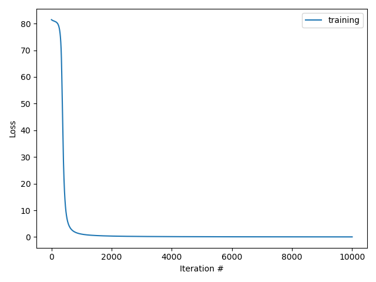

# Truncated backpropagation through time (1990)

## Truncated backpropagation through time for character-level recurrent neural network.

### Table of Contents

- [Images](#images)
- [Description](#description)
- [Keywords](#keywords)
- [How to Use](#how-to-use)
- [References](#references)
- [Author Info](#author-info)

## Images

## Description

"Character-level recurrent neural network."

#### Technologies

- Python programming language

## Keywords

 - Vanilla recurrent neural network
 - Truncated backpropagation through time
 - Character-level recurrent neural network
 - Cross-entropy loss
 - Forward computation
 - Backward computation
 - Gradient clipping

## How to Use

#### Getting started

`gh repo clone berberianareg/Truncated-backpropagation-through-time`

#### Dependencies

see requirements.txt

#### Installation

`pip install numpy`

`pip install matplotlib`

#### Executing the program from command line

`python BPTT.py`

## References

#### Links

- Relevant book - (https://www.amazon.com/Neural-Networks-Learning-Machines-3rd/dp/0131471392)
- Relevant paper - (https://direct.mit.edu/neco/article-abstract/2/4/490/5561/An-Efficient-Gradient-Based-Algorithm-for-On-Line?redirectedFrom=fulltext)

## Author Info

- Twitter - [@berberianareg](https://twitter.com/BerberianNareg)
- LinkedIn - [Nareg Berberian](https://www.linkedin.com/in/nareg-berberian-phd-ab6759b9/)

[Back to the Top](#truncated-backpropagation-through-time-1990)